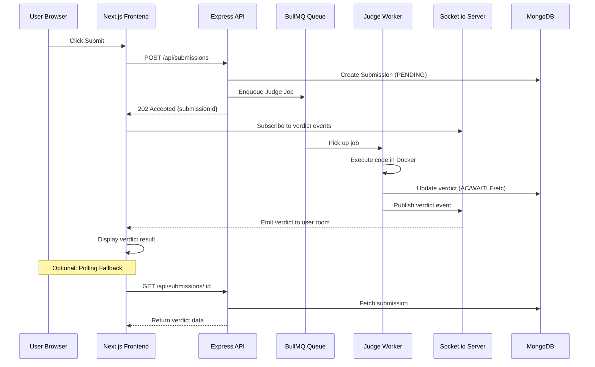
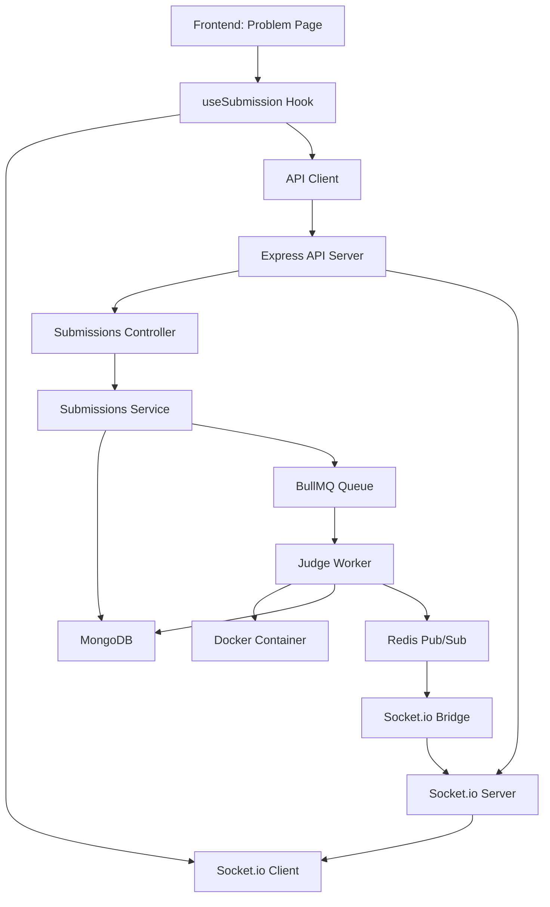

# Design Document: Submission Verdict Display

## Overview

This feature implements real-time submission verdict display on the frontend. Currently, submissions are processed successfully in the backend (visible in Docker logs and MongoDB), but the frontend does not display verdicts to users. This design addresses the gap by implementing proper API endpoints, Socket.io event handling, and UI components to show verdict results including execution time, memory usage, and test case results.

## Main Algorithm/Workflow



## Architecture

### Current System State

**Backend (Working)**:
- Submissions are created with status "PENDING"
- BullMQ worker processes submissions successfully
- Verdicts are stored in MongoDB with correct data (AC, WA, TLE, etc.)
- Socket.io bridge publishes verdict events to Redis channel `socket:verdict`
- Execution metrics (time, memory) are calculated and stored

**Frontend (Broken)**:
- Socket.io connection exists but verdict events may not be properly handled
- `useSubmission` hook listens for verdict events but UI may not update
- No tabbed interface on problem page (Problem vs Submissions tabs)
- No submission history display on problem pages
- No separate submissions page showing all user submissions
- No verdict result component to show detailed results

### System Components



## Core Interfaces/Types

### TypeScript Types (Frontend)

```typescript
// Submission verdict enum
type SubmissionVerdict = 'PENDING' | 'AC' | 'WA' | 'TLE' | 'MLE' | 'RE' | 'CE'

// Submission interface
interface Submission {
  _id: string
  userId: string
  problemId: string
  contestId?: string | null
  language: 'cpp' | 'python'
  code: string
  verdict: SubmissionVerdict
  executionTime: number | null  // milliseconds
  memoryUsed: number | null     // megabytes
  compilerError: string | null
  createdAt: string
  updatedAt: string
}

// Verdict event from Socket.io
interface VerdictEvent {
  submissionId: string
  verdict: SubmissionVerdict
  executionTime: number | null
  memoryUsed: number | null
  compilerError: string | null
}

// Submission history item (without code)
interface SubmissionHistoryItem {
  _id: string
  verdict: SubmissionVerdict
  executionTime: number | null
  memoryUsed: number | null
  language: 'cpp' | 'python'
  createdAt: string
}
```

### API Response Types

```typescript
// POST /api/submissions response
interface SubmitResponse {
  message: string
  submissionId: string
  status: 'queued'
}

// GET /api/submissions/:id response
interface GetSubmissionResponse {
  submission: Submission
}

// GET /api/submissions/problem/:problemId response
interface GetSubmissionHistoryResponse {
  count: number
  submissions: SubmissionHistoryItem[]
}

// GET /api/submissions (all submissions) response
interface GetAllSubmissionsResponse {
  count: number
  submissions: SubmissionWithProblem[]
}

// Submission with problem details (for all submissions page)
interface SubmissionWithProblem extends SubmissionHistoryItem {
  problemId: string
  problemTitle: string
  problemSlug: string
}
```

## Key Functions with Formal Specifications

### Frontend: useSubmission Hook

```typescript
function useSubmission(): UseSubmissionReturn
```

**Preconditions:**
- User must be authenticated (accessToken exists in auth store)
- Socket.io connection must be established before submitting

**Postconditions:**
- Returns submission state and submit function
- Automatically subscribes to Socket.io verdict events
- Updates state when verdict arrives
- Cleans up event listeners on unmount

**Current Issues:**
- Verdict events may not trigger UI updates
- Socket.io connection may not be properly initialized
- Error handling may not cover all edge cases

### Frontend: SubmissionResult Component

```typescript
function SubmissionResult(props: SubmissionResultProps): JSX.Element
```

**Preconditions:**
- `verdict` prop must be a valid SubmissionVerdict value
- `executionTime` and `memoryUsed` are nullable numbers

**Postconditions:**
- Displays verdict with appropriate color coding
- Shows execution metrics when available
- Displays compiler error for CE verdicts
- Provides clear visual feedback for each verdict type

**Current Issues:**
- Component exists but may not handle all verdict types
- Styling may not be consistent with design system
- Error messages may not be user-friendly

### Backend: Socket.io Bridge

```javascript
function initSocketBridge(): void
```

**Preconditions:**
- Redis connection must be established
- Socket.io server must be initialized

**Postconditions:**
- Subscribes to `socket:verdict` Redis channel
- Forwards verdict events to Socket.io clients
- Emits to user-specific room: `user:{userId}`

**Current Issues:**
- Bridge is implemented and working
- Events are published to Redis successfully
- Need to verify Socket.io server emits to correct rooms

### Backend: Verdict Socket Handler

```javascript
function emitVerdict(userId: string, verdictData: VerdictEvent): void
```

**Preconditions:**
- Socket.io server must be initialized
- `userId` must be a valid MongoDB ObjectId string
- `verdictData` must contain submissionId and verdict

**Postconditions:**
- Emits 'verdict' event to room `user:{userId}`
- All connected clients in that room receive the event
- Event data includes submissionId for client-side matching

**Current Issues:**
- Implementation exists in `backend/src/socket/verdict.socket.js`
- Need to verify room naming convention matches frontend expectations
- Need to ensure clients properly join user rooms on connection

## Algorithmic Pseudocode

### Main Submission Flow

```pascal
ALGORITHM handleSubmission(code, language, problemId)
INPUT: code (string), language (enum), problemId (string)
OUTPUT: verdict result displayed to user

BEGIN
  // Step 1: Submit code to backend
  ASSERT code is not empty
  ASSERT user is authenticated
  
  SET isJudging = true
  SET verdict = null
  
  TRY
    response ← POST /api/submissions {
      code: code,
      language: language,
      problemId: problemId
    }
    
    submissionId ← response.submissionId
    SET currentSubmission = { _id: submissionId, verdict: 'PENDING' }
    
  CATCH error
    SET isJudging = false
    SET error = error.message
    RETURN
  END TRY
  
  // Step 2: Wait for verdict via Socket.io
  // (Handled by useEffect in useSubmission hook)
  // When 'verdict' event arrives:
  //   IF event.submissionId === currentSubmission._id THEN
  //     SET verdict = event.verdict
  //     SET executionTime = event.executionTime
  //     SET memoryUsed = event.memoryUsed
  //     SET compilerError = event.compilerError
  //     SET isJudging = false
  //   END IF
  
  // Step 3: Display result
  // (Handled by SubmissionResult component)
  // Renders verdict with color coding and metrics
END
```

**Preconditions:**
- User is authenticated with valid JWT token
- Socket.io connection is established
- Problem exists and is published

**Postconditions:**
- Submission is created in database with PENDING status
- User receives real-time verdict update via Socket.io
- UI displays verdict result with execution metrics
- Loading state is cleared when verdict arrives

**Loop Invariants:** N/A (no loops in main flow)

### Socket.io Event Handling

```pascal
ALGORITHM handleVerdictEvent(event)
INPUT: event of type VerdictEvent
OUTPUT: updated UI state

BEGIN
  ASSERT event.submissionId is defined
  ASSERT event.verdict is valid enum value
  
  // Only update if this verdict is for current submission
  IF currentSubmission is null THEN
    RETURN  // No active submission, ignore event
  END IF
  
  IF event.submissionId ≠ currentSubmission._id THEN
    RETURN  // Event is for different submission, ignore
  END IF
  
  // Update state with verdict data
  SET verdict = event.verdict
  SET executionTime = event.executionTime
  SET memoryUsed = event.memoryUsed
  SET compilerError = event.compilerError
  SET isJudging = false
  SET error = null
  
  // Log for debugging
  LOG "Received verdict:", event.verdict, "for submission:", event.submissionId
END
```

**Preconditions:**
- Socket.io connection is active
- Event listener is registered for 'verdict' events
- Event data contains required fields

**Postconditions:**
- State is updated only if event matches current submission
- UI re-renders with new verdict data
- Loading spinner is hidden

**Loop Invariants:** N/A

### Polling Fallback (Optional)

```pascal
ALGORITHM pollForVerdict(submissionId, maxAttempts, intervalMs)
INPUT: submissionId (string), maxAttempts (number), intervalMs (number)
OUTPUT: verdict data or timeout error

BEGIN
  attempts ← 0
  
  WHILE attempts < maxAttempts DO
    ASSERT attempts ≥ 0 AND attempts < maxAttempts
    
    TRY
      response ← GET /api/submissions/{submissionId}
      submission ← response.submission
      
      IF submission.verdict ≠ 'PENDING' THEN
        // Verdict is ready
        RETURN submission
      END IF
      
    CATCH error
      LOG "Polling error:", error.message
      // Continue polling despite errors
    END TRY
    
    WAIT intervalMs milliseconds
    attempts ← attempts + 1
  END WHILE
  
  // Timeout: verdict not received within max attempts
  THROW Error("Verdict polling timeout")
END
```

**Preconditions:**
- submissionId is valid MongoDB ObjectId
- maxAttempts > 0
- intervalMs > 0

**Postconditions:**
- Returns submission data when verdict is no longer PENDING
- Throws timeout error if max attempts exceeded
- Continues polling despite transient errors

**Loop Invariants:**
- 0 ≤ attempts < maxAttempts throughout loop execution
- Each iteration waits intervalMs before next attempt

## UI Layout Design

### Problem Page Layout (Updated)

```
┌─────────────────────────────────────────────────────────────────────┐
│  LEFT PANEL                    │  RIGHT PANEL                       │
│  ┌──────────────────────────┐  │  ┌──────────────────────────────┐ │
│  │ [Problem] [Submissions]  │  │  │                              │ │
│  └──────────────────────────┘  │  │   Monaco Code Editor         │ │
│                                 │  │                              │ │
│  TAB: Problem                   │  └──────────────────────────────┘ │
│  - Problem Title                │                                   │
│  - Description                  │  [Submit Button]                  │
│  - Constraints                  │  "Your code is being judged..."   │
│  - Sample Test Cases            │                                   │
│                                 │  ┌──────────────────────────────┐ │
│  TAB: Submissions               │  │  VERDICT RESULT              │ │
│  - List of user's submissions   │  │  ✓ Accepted (AC)             │ │
│  - Verdict badges               │  │  Time: 123ms | Memory: 2MB   │ │
│  - Execution metrics            │  └──────────────────────────────┘ │
│  - Click to view details        │                                   │
└─────────────────────────────────────────────────────────────────────┘
```

**Key Features:**
1. **Tabbed Left Panel**: Switch between "Problem" and "Submissions" views
2. **Submissions Tab**: Shows submission history for current problem only
3. **Right Panel**: Code editor + real-time verdict display (unchanged)
4. **Responsive**: Tabs collapse to dropdown on mobile

### Submissions History Page

**Route**: `/submissions`

```
┌─────────────────────────────────────────────────────────────────────┐
│  All Submissions                                    [Filter ▼]       │
├─────────────────────────────────────────────────────────────────────┤
│                                                                       │
│  ┌─────────────────────────────────────────────────────────────┐   │
│  │ Two Sum                                          2024-01-15  │   │
│  │ ✓ Accepted (AC)  │  C++  │  123ms  │  2.1MB                 │   │
│  └─────────────────────────────────────────────────────────────┘   │
│                                                                       │
│  ┌─────────────────────────────────────────────────────────────┐   │
│  │ Binary Search                                    2024-01-15  │   │
│  │ ✗ Wrong Answer (WA)  │  Python  │  95ms  │  1.8MB           │   │
│  └─────────────────────────────────────────────────────────────┘   │
│                                                                       │
│  ┌─────────────────────────────────────────────────────────────┐   │
│  │ Two Sum                                          2024-01-14  │   │
│  │ ⏱ Time Limit Exceeded (TLE)  │  C++  │  >1000ms  │  2.3MB   │   │
│  └─────────────────────────────────────────────────────────────┘   │
│                                                                       │
│  [Load More]                                                          │
└─────────────────────────────────────────────────────────────────────┘
```

**Key Features:**
1. **All Submissions**: Shows submissions across all problems
2. **Problem Name**: Links to problem page
3. **Verdict Badges**: Color-coded (green=AC, red=WA, yellow=TLE, etc.)
4. **Filters**: By verdict, language, date range
5. **Pagination**: Load more submissions
6. **Click to View**: Opens submission detail modal with code

## Example Usage

### Frontend: Submitting Code

```typescript
// In ProblemPage component
const {
  submit,
  verdict,
  executionTime,
  memoryUsed,
  compilerError,
  isJudging,
  error,
  reset,
} = useSubmission()

const handleSubmit = async () => {
  if (!code.trim()) {
    alert('Please write some code before submitting')
    return
  }
  
  try {
    resetSubmission()
    await submit(code, language, problem._id)
    // Verdict will arrive via Socket.io
  } catch (err) {
    console.error('Submission failed:', err)
    alert(err.message)
  }
}

// Render submission result
{verdict && (
  <SubmissionResult
    verdict={verdict}
    executionTime={executionTime}
    memoryUsed={memoryUsed}
    compilerError={compilerError}
  />
)}
```

### Frontend: Tabbed Left Panel (Problem Page)

```typescript
// In ProblemPage component
const [activeTab, setActiveTab] = useState<'problem' | 'submissions'>('problem')

return (
  <div className="h-[calc(100vh-70px)] grid grid-cols-1 lg:grid-cols-2">
    {/* LEFT PANEL: Tabbed View */}
    <div className="overflow-y-auto border-r border-gray-200 bg-white">
      {/* Tab Headers */}
      <div className="flex border-b border-gray-200 sticky top-0 bg-white z-10">
        <button
          onClick={() => setActiveTab('problem')}
          className={`flex-1 px-4 py-3 font-medium ${
            activeTab === 'problem'
              ? 'border-b-2 border-blue-600 text-blue-600'
              : 'text-gray-600 hover:text-gray-900'
          }`}
        >
          Problem
        </button>
        <button
          onClick={() => setActiveTab('submissions')}
          className={`flex-1 px-4 py-3 font-medium ${
            activeTab === 'submissions'
              ? 'border-b-2 border-blue-600 text-blue-600'
              : 'text-gray-600 hover:text-gray-900'
          }`}
        >
          Submissions
        </button>
      </div>
      
      {/* Tab Content */}
      <div className="p-6">
        {activeTab === 'problem' ? (
          <ProblemStatement problem={problem} />
        ) : (
          <SubmissionHistory problemId={problem._id} />
        )}
      </div>
    </div>
    
    {/* RIGHT PANEL: Code Editor (unchanged) */}
    <div className="flex flex-col h-full bg-gray-50">
      {/* ... editor code ... */}
    </div>
  </div>
)
```

### Frontend: Submission History Component (Problem-Specific)

```typescript
// Component: SubmissionHistory (for problem page)
function SubmissionHistory({ problemId }: { problemId: string }) {
  const [submissions, setSubmissions] = useState<SubmissionHistoryItem[]>([])
  const [loading, setLoading] = useState(true)
  
  useEffect(() => {
    const fetchHistory = async () => {
      try {
        const response = await api.get(`/submissions/problem/${problemId}`)
        setSubmissions(response.data.submissions)
      } catch (error) {
        console.error('Failed to fetch submission history:', error)
      } finally {
        setLoading(false)
      }
    }
    
    fetchHistory()
  }, [problemId])
  
  if (loading) {
    return (
      <div className="flex justify-center py-8">
        <div className="animate-spin rounded-full h-8 w-8 border-b-2 border-blue-600"></div>
      </div>
    )
  }
  
  if (submissions.length === 0) {
    return (
      <div className="text-center py-8 text-gray-500">
        <p>No submissions yet</p>
        <p className="text-sm mt-2">Submit your code to see results here</p>
      </div>
    )
  }
  
  return (
    <div className="space-y-3">
      <h3 className="text-lg font-semibold text-gray-900 mb-4">
        Your Submissions ({submissions.length})
      </h3>
      {submissions.map(sub => (
        <div
          key={sub._id}
          className="bg-gray-50 rounded-lg p-4 hover:bg-gray-100 cursor-pointer transition-colors"
          onClick={() => {/* Navigate to submission detail */}}
        >
          <div className="flex items-center justify-between mb-2">
            <VerdictBadge verdict={sub.verdict} />
            <span className="text-xs text-gray-500">
              {new Date(sub.createdAt).toLocaleString()}
            </span>
          </div>
          <div className="flex items-center gap-4 text-sm text-gray-600">
            <span className="font-medium">{sub.language.toUpperCase()}</span>
            {sub.executionTime && <span>{sub.executionTime}ms</span>}
            {sub.memoryUsed && <span>{sub.memoryUsed}MB</span>}
          </div>
        </div>
      ))}
    </div>
  )
}
```

### Frontend: All Submissions Page

```typescript
// Page: app/submissions/page.tsx
export default function SubmissionsPage() {
  const [submissions, setSubmissions] = useState<SubmissionWithProblem[]>([])
  const [loading, setLoading] = useState(true)
  const [filter, setFilter] = useState<'all' | 'AC' | 'WA' | 'TLE'>('all')
  
  useEffect(() => {
    const fetchAllSubmissions = async () => {
      try {
        const response = await api.get('/submissions')
        setSubmissions(response.data.submissions)
      } catch (error) {
        console.error('Failed to fetch submissions:', error)
      } finally {
        setLoading(false)
      }
    }
    
    fetchAllSubmissions()
  }, [])
  
  const filteredSubmissions = filter === 'all'
    ? submissions
    : submissions.filter(s => s.verdict === filter)
  
  return (
    <div className="container mx-auto px-4 py-8">
      <div className="flex items-center justify-between mb-6">
        <h1 className="text-3xl font-bold">All Submissions</h1>
        
        {/* Filter Dropdown */}
        <select
          value={filter}
          onChange={(e) => setFilter(e.target.value as any)}
          className="px-4 py-2 border border-gray-300 rounded-lg"
        >
          <option value="all">All Verdicts</option>
          <option value="AC">Accepted</option>
          <option value="WA">Wrong Answer</option>
          <option value="TLE">Time Limit Exceeded</option>
        </select>
      </div>
      
      {loading ? (
        <div className="flex justify-center py-12">
          <div className="animate-spin rounded-full h-12 w-12 border-b-2 border-blue-600"></div>
        </div>
      ) : filteredSubmissions.length === 0 ? (
        <div className="text-center py-12 text-gray-500">
          <p>No submissions found</p>
        </div>
      ) : (
        <div className="space-y-4">
          {filteredSubmissions.map(sub => (
            <div
              key={sub._id}
              className="bg-white rounded-lg border border-gray-200 p-6 hover:shadow-md transition-shadow cursor-pointer"
              onClick={() => {/* Navigate to problem or show detail modal */}}
            >
              <div className="flex items-start justify-between mb-3">
                <div>
                  <h3 className="text-lg font-semibold text-gray-900 hover:text-blue-600">
                    {sub.problemTitle}
                  </h3>
                  <p className="text-sm text-gray-500 mt-1">
                    {new Date(sub.createdAt).toLocaleString()}
                  </p>
                </div>
                <VerdictBadge verdict={sub.verdict} size="large" />
              </div>
              
              <div className="flex items-center gap-6 text-sm text-gray-600">
                <span className="font-medium">{sub.language.toUpperCase()}</span>
                {sub.executionTime && (
                  <span className="flex items-center gap-1">
                    <ClockIcon className="w-4 h-4" />
                    {sub.executionTime}ms
                  </span>
                )}
                {sub.memoryUsed && (
                  <span className="flex items-center gap-1">
                    <MemoryIcon className="w-4 h-4" />
                    {sub.memoryUsed}MB
                  </span>
                )}
              </div>
            </div>
          ))}
        </div>
      )}
    </div>
  )
}
```

### Backend: Emitting Verdict (Already Implemented)

```javascript
// In submission.worker.js (already working)
await redis.publish('socket:verdict', JSON.stringify({
  userId,
  verdictData: {
    submissionId,
    verdict: verdict.verdict,
    executionTime: verdict.executionTime,
    memoryUsed: verdict.memoryUsed,
    compilerError: verdict.compilerError
  }
}))

// In socket/bridge.js (already working)
subscriber.on('message', (channel, message) => {
  const data = JSON.parse(message)
  
  if (channel === 'socket:verdict') {
    emitVerdict(data.userId, data.verdictData)
  }
})

// In socket/verdict.socket.js (need to verify)
function emitVerdict(userId, verdictData) {
  const io = getIO()
  io.to(`user:${userId}`).emit('verdict', verdictData)
}
```

## Correctness Properties

*A property is a characteristic or behavior that should hold true across all valid executions of a system—essentially, a formal statement about what the system should do. Properties serve as the bridge between human-readable specifications and machine-verifiable correctness guarantees.*

### Property 1: Submission Creation Returns ID

*For any* valid code submission with a valid problem ID and language, the system should create a submission with PENDING status and return a submission ID.

**Validates: Requirements 1.1, 6.1, 6.5**

### Property 2: Verdict Delivery Guarantee

*For any* submission that completes judging, the user should receive a verdict update either via Socket.io or polling within a reasonable timeout period.

**Validates: Requirements 1.3, 1.4, 1.7, 7.3, 7.4, 7.5, 8.3**

### Property 3: Submission Ownership Authorization

*For any* user and submission, the user can view the submission if and only if they own it (submission.userId === user._id), otherwise the system returns 403 Forbidden.

**Validates: Requirements 2.1, 2.2**

### Property 4: Submission History Filtering

*For any* user requesting submission history (for a specific problem or all problems), all returned submissions should belong to that user only.

**Validates: Requirements 2.3, 6.3**

### Property 5: Socket.io Room Isolation

*For any* verdict event emitted by the Socket server, the event should only be received by the submission owner's Socket.io room and no other users.

**Validates: Requirements 2.4**

### Property 6: Code Field Exclusion in History

*For any* submission history response (problem-specific or all submissions), the response objects should not contain the code field.

**Validates: Requirements 2.5**

### Property 7: Tab State Preservation

*For any* code editor state and scroll position, switching between Problem and Submissions tabs should preserve both the editor content and scroll position unchanged.

**Validates: Requirements 3.4**

### Property 8: Submission Display Completeness

*For any* submission displayed in history (problem-specific or all submissions), the rendered output should include verdict badge, language, execution time (if available), memory usage (if available), and timestamp.

**Validates: Requirements 3.6, 4.2, 5.2**

### Property 9: Submission History Fetch

*For any* problem ID, when a user opens the Submissions tab, the system should fetch all submissions for that problem belonging to the user.

**Validates: Requirements 4.1**

### Property 10: All Submissions Fetch

*For any* authenticated user navigating to /submissions, the system should fetch and display all user submissions across all problems with problem details included.

**Validates: Requirements 5.1, 6.4**

### Property 11: Verdict Filter Correctness

*For any* verdict filter selection on the all-submissions page, all displayed submissions should have a verdict matching the selected filter.

**Validates: Requirements 5.4**

### Property 12: Submission Retrieval with Code

*For any* submission ID owned by the requesting user, GET /api/submissions/:id should return the complete submission including the code field.

**Validates: Requirements 6.2**

### Property 13: Submission History Sort Order

*For any* submission history response, submissions should be ordered by creation date in descending order (newest first).

**Validates: Requirements 6.7**

### Property 14: Socket.io Room Assignment

*For any* authenticated user establishing a Socket.io connection, the server should join that user to a room named "user:{userId}" where userId matches the JWT token.

**Validates: Requirements 7.2**

### Property 15: Verdict Event Filtering

*For any* verdict event received by the frontend, if the event's submissionId does not match the current submission ID, the event should be ignored and state should remain unchanged.

**Validates: Requirements 7.6**

### Property 16: Polling Termination on Verdict

*For any* active polling session, when a non-PENDING verdict is received, polling should stop immediately and the verdict should be displayed.

**Validates: Requirements 8.3**

### Property 17: Verdict Display Includes Metrics

*For any* verdict displayed to the user, if execution time and memory usage are available (non-null), they should be shown in the UI alongside the verdict.

**Validates: Requirements 1.5, 9.7**

### Property 18: Error State Clears Loading

*For any* submission API error (4xx or 5xx), the frontend should clear the loading state (isJudging = false) and allow the user to retry.

**Validates: Requirements 10.1, 10.2**

### Property 19: Verdict Immutability

*For any* submission that receives a terminal verdict (AC, WA, TLE, MLE, RE, CE), the verdict should never change to a different value in subsequent queries.

**Validates: Implicit correctness requirement from design**

## Error Handling

### Error Scenario 1: Socket.io Connection Failure

**Condition**: User's Socket.io connection drops or fails to establish

**Response**:
- Frontend detects connection failure via `socket.connected` check
- Falls back to polling GET /api/submissions/:id every 2 seconds
- Displays warning message: "Real-time updates unavailable, polling for results"

**Recovery**:
- Attempt to reconnect Socket.io in background
- Switch back to Socket.io when connection restored
- Stop polling when verdict received

### Error Scenario 2: Submission API Failure

**Condition**: POST /api/submissions returns 4xx or 5xx error

**Response**:
- Display error message from API response
- Clear loading state (isJudging = false)
- Allow user to retry submission
- Log error details for debugging

**Recovery**:
- User can edit code and resubmit
- No automatic retry (user-initiated only)
- Preserve code in editor (don't clear on error)

### Error Scenario 3: Verdict Event for Wrong Submission

**Condition**: Socket.io emits verdict for different submissionId than current

**Response**:
- Ignore event (don't update UI state)
- Log warning for debugging
- Continue waiting for correct verdict event

**Recovery**:
- No action needed (correct event will arrive)
- Polling fallback will catch verdict if Socket.io fails

### Error Scenario 4: Polling Timeout

**Condition**: Verdict not received after max polling attempts (30 attempts × 2s = 60s)

**Response**:
- Display error: "Verdict not received, please refresh page"
- Clear loading state
- Provide "Check Status" button to manually fetch verdict

**Recovery**:
- User clicks "Check Status" to retry GET /api/submissions/:id
- User refreshes page to reset state
- Admin investigates stuck submission in worker logs

### Error Scenario 5: Compiler Error (CE Verdict)

**Condition**: Code fails to compile (C++ syntax error, Python import error)

**Response**:
- Display verdict: "Compilation Error"
- Show compiler error message in monospace font
- Highlight relevant error lines if possible

**Recovery**:
- User fixes compilation errors
- User resubmits corrected code
- No automatic retry

## Testing Strategy

### Unit Testing Approach

**Frontend Unit Tests** (Jest + React Testing Library):
- `useSubmission` hook state management
- Socket.io event handler logic
- SubmissionResult component rendering for each verdict type
- API client error handling

**Backend Unit Tests** (Jest + Supertest):
- Submissions controller request/response handling
- Submissions service business logic
- Socket.io bridge message forwarding
- Verdict socket emission

**Key Test Cases**:
- Submit code with valid inputs → returns 202 with submissionId
- Submit code with invalid problemId → returns 404
- Get submission with correct userId → returns submission data
- Get submission with wrong userId → returns 403
- Get submission history → returns array filtered by userId
- Socket.io verdict event → updates UI state correctly

### Property-Based Testing Approach

**Property Test Library**: fast-check (JavaScript/TypeScript)

**Property 1: Verdict Event Matching**
```typescript
fc.assert(
  fc.property(
    fc.string(), // submissionId
    fc.constantFrom('AC', 'WA', 'TLE', 'MLE', 'RE', 'CE'), // verdict
    fc.nat(), // executionTime
    fc.nat(), // memoryUsed
    (submissionId, verdict, executionTime, memoryUsed) => {
      const event = { submissionId, verdict, executionTime, memoryUsed }
      const result = handleVerdictEvent(event, { _id: submissionId })
      return result.verdict === verdict &&
             result.executionTime === executionTime &&
             result.memoryUsed === memoryUsed
    }
  )
)
```

**Property 2: Submission Ownership**
```typescript
fc.assert(
  fc.property(
    fc.string(), // userId1
    fc.string(), // userId2
    fc.string(), // submissionId
    async (userId1, userId2, submissionId) => {
      fc.pre(userId1 !== userId2) // Precondition: different users
      
      const submission = await createSubmission({ userId: userId1, _id: submissionId })
      
      // User1 can view their own submission
      const result1 = await getSubmission(submissionId, userId1)
      const canView1 = result1 !== null
      
      // User2 cannot view User1's submission
      try {
        await getSubmission(submissionId, userId2)
        return false // Should have thrown 403
      } catch (error) {
        return error.statusCode === 403 && canView1
      }
    }
  )
)
```

### Integration Testing Approach

**End-to-End Tests** (Playwright):
1. User submits code → sees "Judging..." loading state
2. Verdict arrives via Socket.io → UI updates with result
3. User views submission history → sees previous attempts
4. User clicks submission → sees full details including code

**Socket.io Integration Tests**:
1. Worker publishes verdict to Redis → Bridge receives message
2. Bridge emits to Socket.io → Client receives event
3. Client updates UI → Verdict displayed correctly

**API Integration Tests**:
1. POST /api/submissions → Creates submission in database
2. GET /api/submissions/:id → Returns correct submission
3. GET /api/submissions/problem/:problemId → Returns filtered list

## Performance Considerations

### Real-Time Update Latency

**Target**: Verdict displayed within 500ms of worker completion

**Optimization Strategies**:
- Use Redis pub/sub for low-latency event delivery (<10ms)
- Socket.io binary protocol for efficient message encoding
- Minimize verdict event payload size (only essential fields)
- Use Socket.io rooms for targeted event delivery (not broadcast)

**Measurement**:
- Log timestamp when worker updates database
- Log timestamp when client receives Socket.io event
- Calculate latency: clientReceiveTime - workerUpdateTime
- Alert if latency exceeds 1 second

### Submission History Query Performance

**Target**: Load submission history in <200ms for 100 submissions

**Optimization Strategies**:
- Use compound index: { userId: 1, problemId: 1, createdAt: -1 }
- Exclude code field from list queries (reduce payload size)
- Limit results to 50 most recent submissions
- Use pagination for users with >50 submissions

**Measurement**:
- Monitor query execution time in MongoDB slow query log
- Track API response time for GET /submissions/problem/:problemId
- Alert if p95 latency exceeds 500ms

### Socket.io Connection Overhead

**Target**: Support 1000 concurrent Socket.io connections per server

**Optimization Strategies**:
- Use Socket.io sticky sessions for load balancing
- Enable Socket.io Redis adapter for horizontal scaling
- Set connection timeout to 60 seconds (disconnect idle clients)
- Use binary protocol to reduce bandwidth

**Measurement**:
- Monitor active Socket.io connections via socket.io-admin
- Track memory usage per connection (~10KB per socket)
- Alert if connection count exceeds 1000 per server

## Security Considerations

### Submission Ownership Validation

**Threat**: User attempts to view another user's submission by guessing submissionId

**Mitigation**:
- Enforce ownership check in service layer: `submission.userId === userId`
- Return 403 Forbidden (not 404) for unauthorized access
- Use MongoDB ObjectIds (128-bit, hard to enumerate)
- Rate limit GET /api/submissions/:id to prevent brute force

**Verification**:
- Test with mismatched userId → expect 403
- Test with invalid submissionId → expect 404
- Test rate limiting → expect 429 after threshold

### Socket.io Room Isolation

**Threat**: User joins another user's Socket.io room to receive their verdicts

**Mitigation**:
- Server-side room assignment only (client cannot join arbitrary rooms)
- Authenticate Socket.io connection with JWT token
- Emit verdicts to `user:{userId}` room (not broadcast)
- Validate userId from JWT matches room name

**Verification**:
- Test client cannot manually join other user's room
- Test verdict events only received by correct user
- Test unauthenticated clients cannot connect

### Code Privacy

**Threat**: User accesses another user's source code via API

**Mitigation**:
- Exclude code from submission history endpoint
- Require ownership validation for GET /api/submissions/:id
- Never expose code in Socket.io events (only verdict data)
- Log all submission access attempts for audit

**Verification**:
- Test GET /submissions/problem/:problemId excludes code field
- Test GET /submissions/:id requires ownership
- Test Socket.io verdict events don't contain code

## Dependencies

### Frontend Dependencies

**Existing**:
- `socket.io-client`: ^4.x - Real-time communication
- `axios`: ^1.x - HTTP client (wrapped in `lib/api.ts`)
- `zustand`: ^4.x - State management (auth store)
- `react`: ^18.x - UI framework
- `next`: ^14.x - React framework

**New** (if needed):
- None - all required dependencies already installed

### Backend Dependencies

**Existing**:
- `socket.io`: ^4.x - Real-time server
- `ioredis`: ^5.x - Redis client for pub/sub
- `bullmq`: ^4.x - Job queue
- `mongoose`: ^8.x - MongoDB ODM
- `express`: ^4.x - HTTP server

**New** (if needed):
- None - all required dependencies already installed

### Infrastructure Dependencies

**Required Services**:
- MongoDB: Submission data storage
- Redis: Socket.io adapter + BullMQ queue + pub/sub
- Docker: Judge container execution
- Node.js: ^18.x or ^20.x

**Optional Services**:
- S3: Hidden test case storage (already implemented)
- CloudWatch: Logging and monitoring (future)
